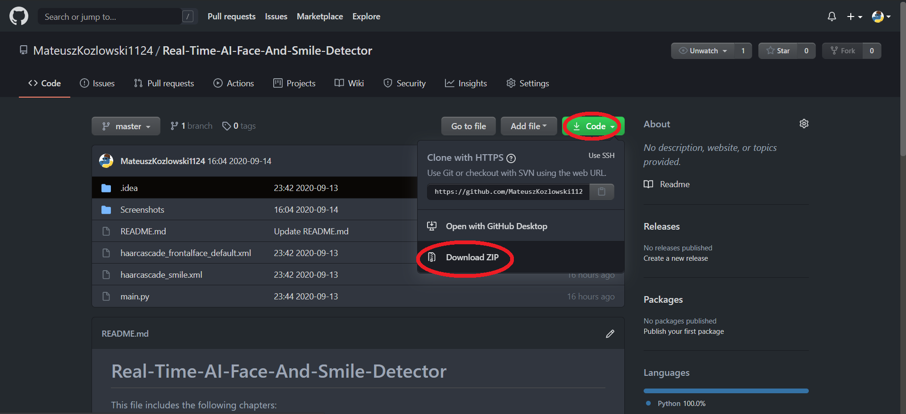

# Real-Time-AI-Face-And-Smile-Detector

This file includes the following chapters:
1. Requirements
2. Project description
3. How to install
4. Tips

# 1. Requirements:
* A webcam connected to your computer
* Good lighting

Python 3.8 with following modules installed:
* NumPy
* OpenCV 4.4 for Python

# 2. Project Description:
The project is my modification of [Real Time AI Smile Detector](https://youtu.be/uLY5JSE5WAU).
It can recognize faces and smiles using the [haar algorithm](https://opencv-python-tutroals.readthedocs.io/en/latest/py_tutorials/py_objdetect/py_face_detection/py_face_detection.html).
I used a ready-made model from the [openCV library github](https://github.com/opencv/opencv/tree/master/data/haarcascades)

IMPORTANT NOTE: the program can only be closed by pressing the escape key (it cannot be closed by clicking on the red X in the upper right corner of the window).

# 3. How to install:
If you're familiar with git you can clone the repo. Otherwise you can simply download whole project as a compressed folder.

Then you need to make sure your device meets the requirements in chapter 1 (appropriate libraries installed).
You can install them with pip from the command line.

Finally run the program using command line. Navigate to the directory, where the project is located and type python main.py

Wait a few second...
And you should see sth like that:
(comming soon!)

# 4. Tips:
The program is not perfect, so undesirable objects can be classified as a face.
If you want it to work perfectly, you should set your face against a wall or other monocolor object.

IMPORTANT NOTE: the program can only be closed by pressing the escape key (it cannot be closed by clicking on the red X in the upper right corner of the window). 
